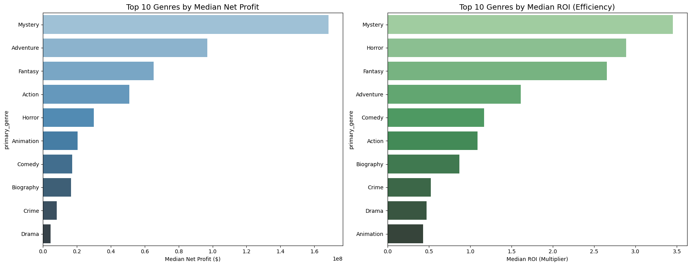
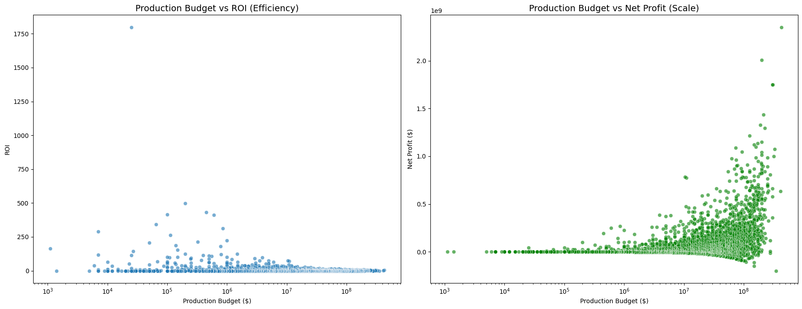
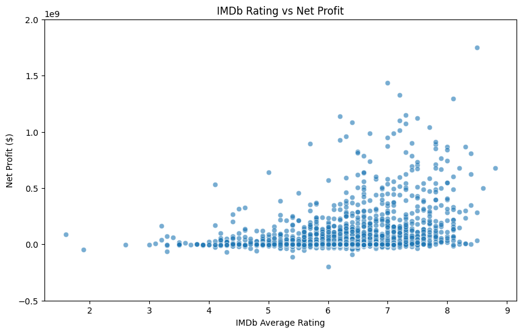
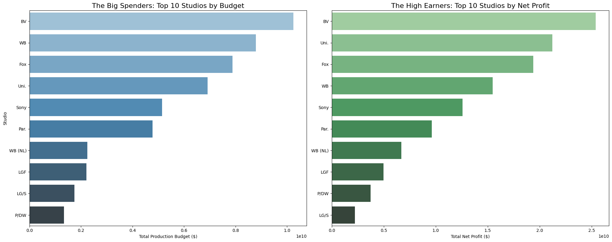

# Phase 2 Project (DS)
# Group 3
## This README provides a comprehensive overview of the Strategic Film Selection Analysis project, incorporating details from the group's non-technical presentation and technical notebook.

## **1. Project Overview**
This project aims to provide actionable insights for a company launching a new movie studio. By analyzing historical box office performance, the study identifies which types of films yield the highest revenue and return on investment (ROI) to guide production decisions.

## **2. Business Problem**

The core challenge is that the new studio lacks industry experience. To ensure commercial success, the studio needs data-driven answers to the following:

- Which genres generate the highest revenue and ROI? 

- How does the production budget impact profitability? 

- What is the relationship between critical acclaim (IMDB ratings) and box office success? 

- Which established studios currently dominate the market?

## **3. Data Understanding and Analysis**

### Data Source
- Movie datasets were obtained from a [Github repository](https://github.com/learn-co-curriculum/dsc-phase-2-project-v3/tree/main/zippedData) and stored locally in the directory, "Data".

The analysis integrates data from multiple sources:
- **CSV Files:** Financial records including production budgets and worldwide gross revenue.
- **SQLite Database:** Movie metadata, including fan ratings, genres, and runtimes
### Data Description

The dataset includes thousands of film records spanning the last two decades. 
Key features analyzed include:
- **production_budget:** The cost to produce the film.
- **worldwide_gross:** Total global revenue.
- **Net_profit:**  Calculated as $Worldwide Gross - Production Budget$
- **Return on Investment (ROI):** Calculated as $(Worldwide Gross - Budget) / Budget$.
- **genres:** Exploded categories to analyze performance at the individual genre level.

## **Visualisations**
### 1. Net Profit & Return on Investment (ROI) by Genre
#### Which genres generate the highest Revenue and ROI?

**Key Finding:**  
- _While Action movies generate the highest median net profit, Horror and Mystery films lead in ROI due to lower production costs._

### 2. Production Budget vs ROI & Net Profit
#### How does the production budget impact profitability?

**Key Finding**
- _Movies that dominate high profits do not dominate high ROI. This suggests that large studios benefit from scale, while small studios achieve efficiency with low-budget  genre films._

### 3. IMDB Rating vs Net Profit
#### What is the relationship between critical acclaim (IMDB ratings) and box office success?

**Key Findings**
- _Even highly profitable films fall outside of IMDB’s highest ratings._
- _Critical acclaim is not a prerequisite for box office success, however successful movies clustered within the range 6.5 - 8.5_

### 4. The big Spenders and the high earning studios
#### Which established studios currently dominate the market?

**Key Findings**
- _Nine of the big spenders make it into the high earners list._
- _Buena Vista (BV) dominate box office revenue, reflecting the advantage of established franchises._

### **For a dynamic exploration of these metrics, visit the Interactive Analysis Dashboard [here](https://public.tableau.com/views/group3phase2project/Story1?:language=en-GB&publish=yes&:sid=&:redirect=auth&:display_count=n&:origin=viz_share_link)**

## **Recommendations and Conclusion**

### Recommendations

- _Launch with low-budget Horror & Mystery titles to maximize ROI and minimize downside risk._
- _Transition to mid-to-high budget Action to capture massive net profit._
- _Collaborate with established leaders (e.g., Buena Vista) on major projects to leverage their funding, resources, and global distribution._

### Conclusion

- The results show that while blockbusters (Action, Adventure) yield the highest absolute profit, smaller budget films (esp Horror) yield greater ROI. This suggests a two-phase strategy: begin with low-budget, high-ROI genre films to build capital, then selectively invest in higher-budget franchise films to maximize long-term profitability.

- _By balancing Efficiency (ROI) with Scale (Net Profit), we minimize initial exposure while building a roadmap for long-term commercial dominance._
